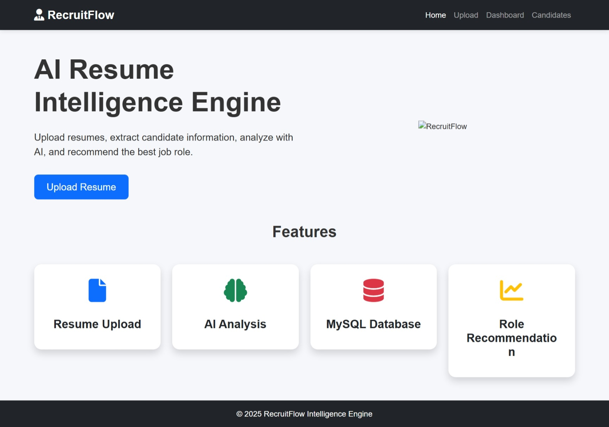
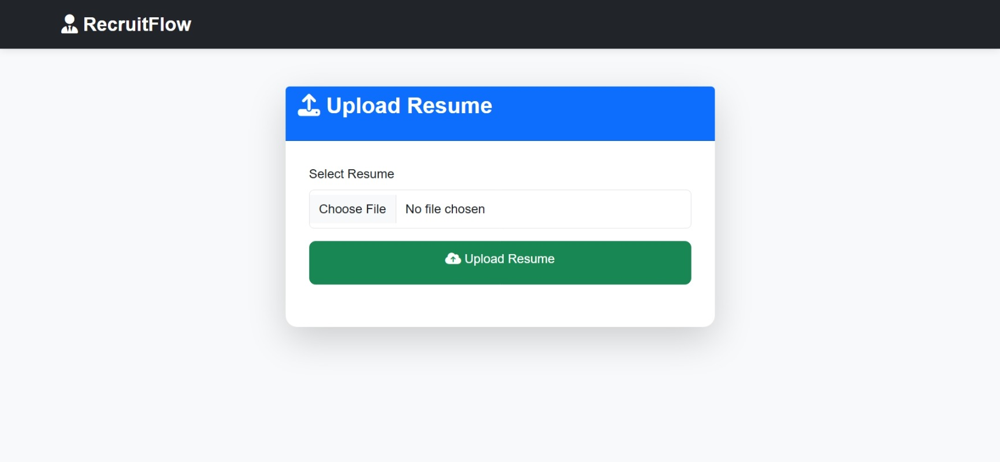
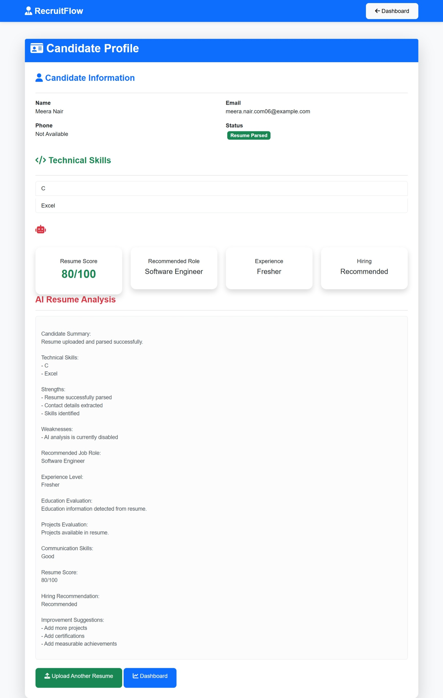
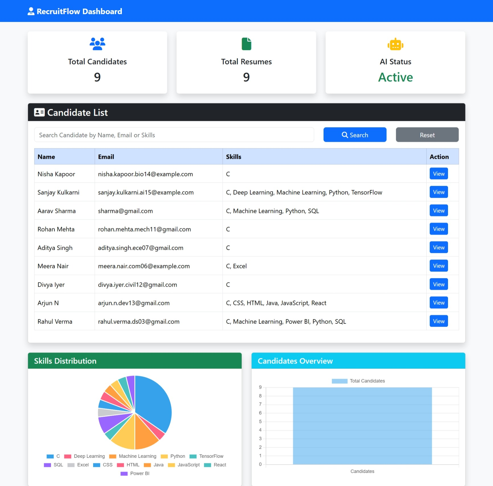

# RecruitFlow Intelligence Engine

## Overview

**RecruitFlow Intelligence Engine** is an AI-powered Resume Intelligence System designed to automate and improve the recruitment process.

The system allows recruiters to upload resumes, automatically extract candidate information, analyze candidate profiles using **Google Gemini AI**, generate suitability scores, and recommend suitable job roles.

RecruitFlow reduces manual resume screening effort and helps recruiters make faster and better hiring decisions.

---

# Features

## Resume Processing
- Upload PDF and DOCX resumes
- Automatic resume parsing
- Candidate information extraction
- Skill identification

## AI-Powered Analysis
- Resume analysis using Google Gemini AI
- Candidate profile generation
- Job role recommendation
- Resume suitability scoring

## Recruiter Dashboard
- Candidate management
- Candidate analytics
- Graph-based visualization
- Resume insights

## Database Support
- SQLite database integration
- MySQL support

---

# Technology Stack

## Frontend
- HTML5
- CSS3
- JavaScript
- Bootstrap 5

## Backend
- Python
- Flask
- SQLAlchemy

## Database
- SQLite / MySQL

## Artificial Intelligence
- Google Gemini API

## Resume Processing
- PyMuPDF
- python-docx

---

# Project Architecture

```
                 User / Recruiter
                        |
                        |
                 Upload Resume
                        |
                        |
              Frontend (HTML/CSS/JS)
                        |
                        |
              Flask Backend API
                        |
        --------------------------------
        |                              |
 Resume Parser                  Gemini AI Engine
        |                              |
        --------------------------------
                        |
                        |
              Candidate Analysis
                        |
                        |
              Database Storage
                        |
                        |
              Recruiter Dashboard
```

---

# Project Structure

```
RecruitFlow/
│
├── backend/
│   ├── app.py
│   ├── routes.py
│   ├── parser.py
│   ├── ai_engine.py
│   ├── database.py
│   ├── models.py
│   ├── requirements.txt
│   └── uploads/
│
├── frontend/
│   ├── index.html
│   ├── upload.html
│   ├── candidate.html
│   ├── dashboard.html
│   ├── css/
│   └── js/
│
├── screenshots/
│   ├── home.jpeg
│   ├── upload.jpeg
│   ├── candidate.jpeg
│   └── dashboard.jpeg
│
└── README.md
```

---

# Installation & Setup

## Clone Repository

```bash
git clone https://github.com/lokesh4417/RecuritFlow.git

cd RecuritFlow
```

---

## Create Virtual Environment

```bash
python -m venv venv
```

---

## Activate Virtual Environment

### Windows

```bash
venv\Scripts\activate
```

### Linux / macOS

```bash
source venv/bin/activate
```

---

## Install Dependencies

```bash
pip install -r backend/requirements.txt
```

---

## Configure Gemini API

Add your Google Gemini API key in the backend configuration.

Example:

```
GEMINI_API_KEY = "your_api_key"
```

---

## Run Backend

```bash
cd backend

python app.py
```

Backend will start at:

```
http://127.0.0.1:5000
```

---

## Run Frontend

Open:

```
frontend/index.html
```

using **Live Server** in VS Code.

---

# Screenshots

## Home Page



---

## Resume Upload Page



---

## Candidate Analysis Page



---

## Recruiter Dashboard



---

# Future Improvements

- Resume ranking system
- Advanced candidate filtering
- User authentication
- Interview scheduling module
- ATS integration
- Email notifications
- Skill gap analysis
- Cloud deployment
- Multiple recruiter accounts

---

#  Developed By

## Lokesh Galiveti

**B.Tech Computer Science and Engineering**  
**Artificial Intelligence & Machine Learning**

---

# License

This project is developed for educational and learning purposes.